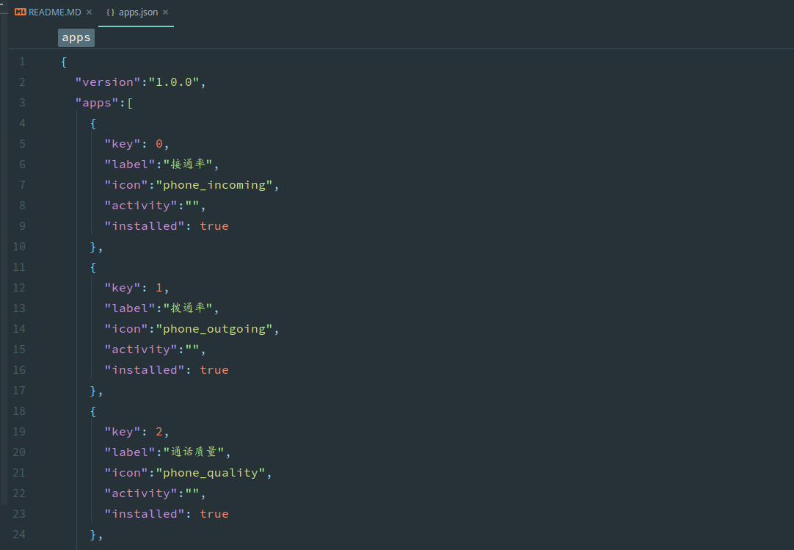
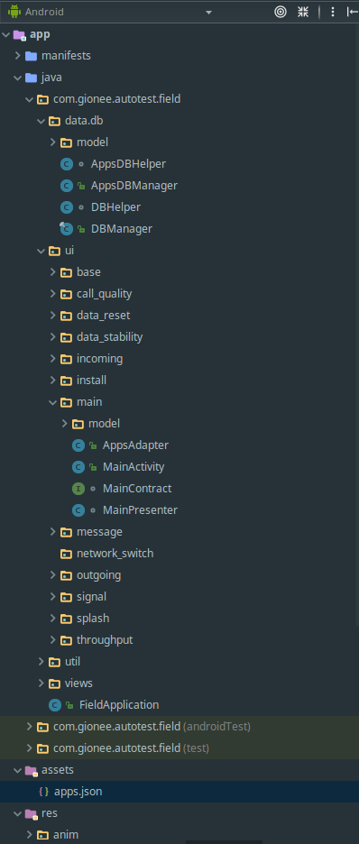
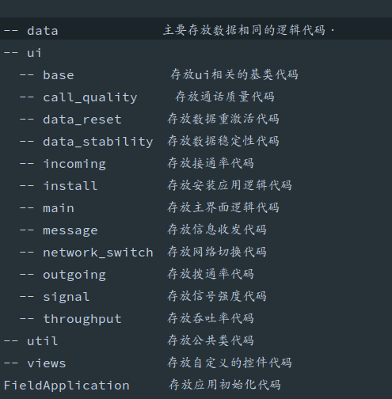

## Field Testing

Field Testing source code.

### How To Use?

框架的主界面：

应用安装界面：

**如何在主界面配置自己的应用**

在app项目的assets下的apps.json文件中apps节点下添加应用信息：

每一次这个文件的更新必须同步更新version界面的信息!!!

apps下节点的配置参数讲解：

key: 此应用的一个整型键值，必须每一个应用唯一！！！

label:　此应用的简洁描述

icon:　此应用的图标，在主界面显示．

activity:　此应用的启动Activity名称，可以全类目如com.gionee.autotest.field.ui.about.AboutActivity,
或者省略包名的方式.ui.about.AboutActivity,注意：省略包名必须以.开头．

installed:　此应用默认是否安装，如果为true，则在应用的启动界面会默认显示．

**项目结构**

各包的定义如下：

**项目遵循MVP开发模式，若自己的模块简单不必完全使用该开发模式！！！**

### 更新说明

V1.02.22L
-------------------------------------------

1.修改记录质量按钮点击效果不明显的问题；
2.修改关于里面显示的版本问题；
3.在记录质量和信号监控里面添加查看报告的菜单；

### License
 
     Copyright 2017 Gionee, Inc.
     
     Copyright 2017 Viking Den <dengwj@gionee.com>
     
     Licensed under the Apache License, Version 2.0 (the "License");
     you may not use this file except in compliance with the License.
     You may obtain a copy of the License at
     
        http://www.apache.org/licenses/LICENSE-2.0
     
     Unless required by applicable law or agreed to in writing, software
     distributed under the License is distributed on an "AS IS" BASIS,
     WITHOUT WARRANTIES OR CONDITIONS OF ANY KIND, either express or implied.
     See the License for the specific language governing permissions and
     limitations under the License.